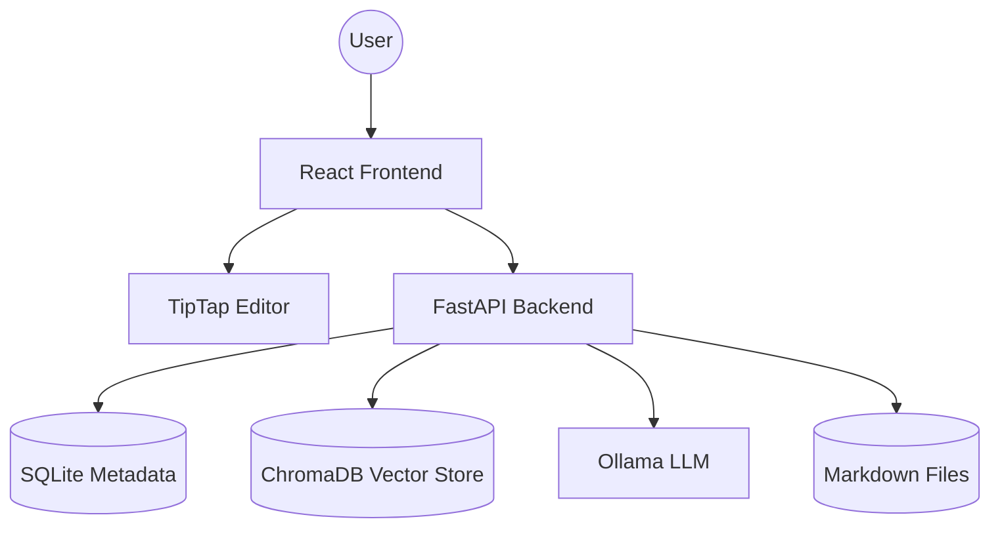

# MindVault 

MindVault is a privacy-first, offline-capable local knowledge management app with semantic search and RAG capabilities. It allows you to take notes, index them locally, and ask questions using a local LLM.

## Architecture



## Features
- **Privacy-First**: Everything runs locally. No cloud calls.
- **Semantic Search**: Find notes based on meaning, not just keywords.
- **RAG Pipeline**: Ask questions about your notes and get AI-generated answers using Ollama.
- **Markdown Editor**: TipTap-based editor with live preview and markdown support.
- **Related Notes**: Automatically see notes related to what you're currently writing.
- **Import**: Easily import your existing Obsidian vaults or markdown folders.

## Tech Stack
- **Frontend**: React, TypeScript, TailwindCSS, TipTap, Axios, Lucide
- **Backend**: FastAPI, SQLAlchemy, SQLite, ChromaDB, Ollama.
- **Embeddings**: `sentence-transformers` (all-MiniLM-L6-v2) running on the backend.
- **LLM**: Ollama (llama3).

## Setup Instructions

### Prerequisites
- Docker & Docker Compose
- Python 3.9+
- Node.js 18+
- [Ollama](https://ollama.com) installed and running locally.

### 1. Spin up Core Services
```bash
docker-compose up -d
```
This starts ChromaDB. Make sure Ollama is running on your host machine at http://localhost:11434.

### 2. Backend Setup
```bash
cd backend
pip install -r requirements.txt
cp ../env.example .env
uvicorn main:app --reload
```

### 3. Frontend Setup
```bash
cd frontend
npm install
npm run dev
```

### 4. Pull LLM Model
```bash
ollama pull llama3
```

## User Flow
1. **Create a Note**: Click the "+" button in the sidebar.
2. **Write Content**: Use the TipTap editor to write in Markdown.
3. **Semantic Search**: Switch to the "AI Chat" view to ask questions about your notes.
4. **Get Answers**: The AI retrieves relevant context from your notes and answers via Ollama.
